

[![LinkedIn][linkedin-shield]][linkedin-url]

<!-- PROJECT LOGO -->
 

    
  <h3 align="center">Mediation System Data Automation</h3>

<!-- TABLE OF CONTENTS -->

  
Table of Contents

  <ol>
    <li>
      <a href="#about-the-project">About The Project</a>
      <ul>
        <li><a href="#business-case">Business Case</a></li>
        <li><a href="#technical-solution">Technical Solution</a></li>
        <li><a href="#screenshots">Screenshots</a></li>
        <li><a href="#tech-stack">Tech Stack</a></li>
      </ul>
    </li>
    <li><a href="#contact">Contact</a></li>
  </ol>

<!-- ABOUT THE PROJECT -->
## About The Project

* **Project Name:** Mediation System Data Automation
* **Version:** v1.0.0  
* **Department:** Technology

---

### Business Case

The Mediation system requires the analysis of logs from a Solaris server and data from multiple Oracle database tables to provide full visibility into system performance. Previously, I had to manually log into the Solaris system to find and download six different logs, run separate database queries, and merge the results. This was a lengthy, frustrating, and error-prone process.

This tool automates the entire process, reducing a multi-hour task to just two clicks and less than two minutes, pulling logs, running database queries, and merging the data into a final report that provides critical insights into the system.

(<a href="#readme-top">back to top</a>)

### Technical Solution

The solution automates the acquisition and analysis of both Solaris log files and Oracle database records, merging them into one comprehensive dataset. Key features include:

* **Log File Retrieval:** Automatically pulls the latest six logs from the Solaris remote server, across different paths, based on file name patterns.
* **Database Queries:** Runs seven queries on six different Oracle database tables and retrieves essential data.
* **Data Cleaning:** Cleans the raw, often "dirty" data to ensure accuracy.
* **CPU & Memory Analysis:** Analyzes system performance, including CPU and memory utilization.
* **Feature Engineering:** Builds two dataframes with full information about the system.
* **Data Export:** Saves both raw and cleaned datasets in `.csv` files for further analysis or storage.

(<a href="#readme-top">back to top</a>)

### Screenshots

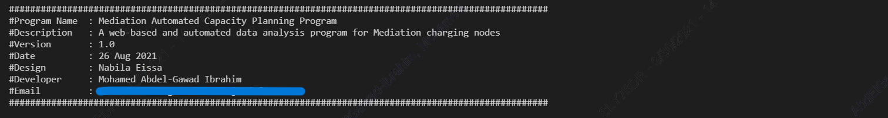
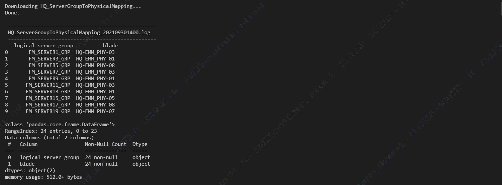
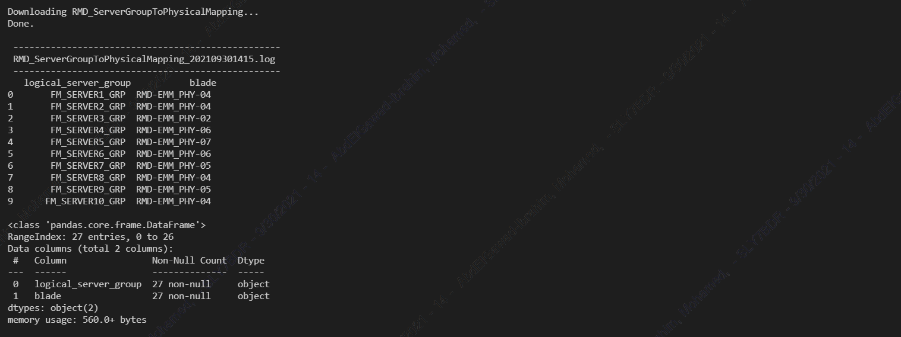
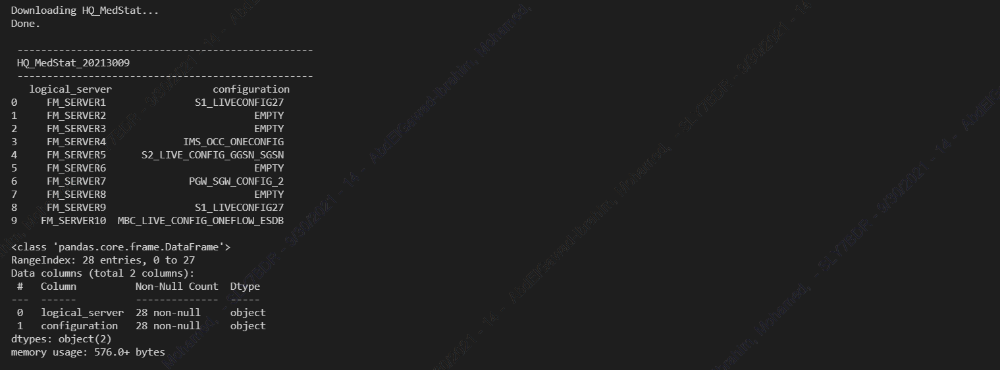
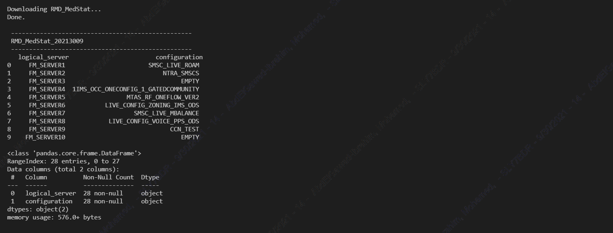
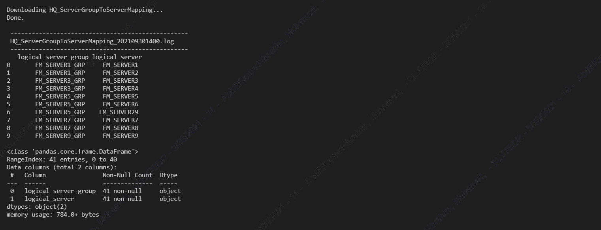
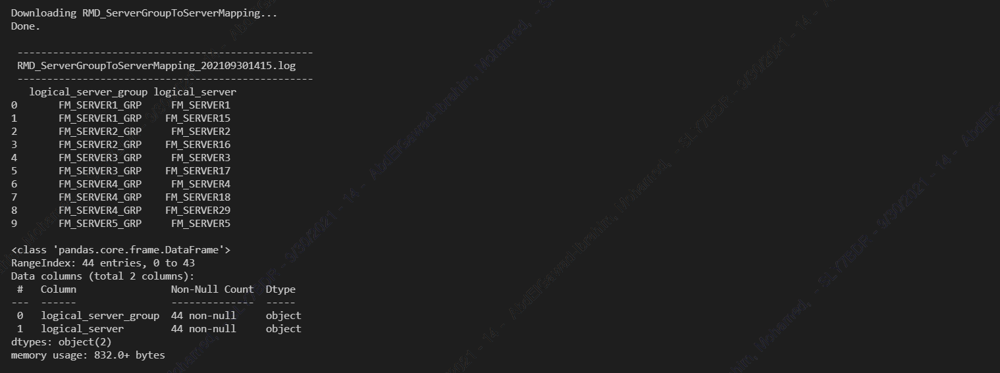
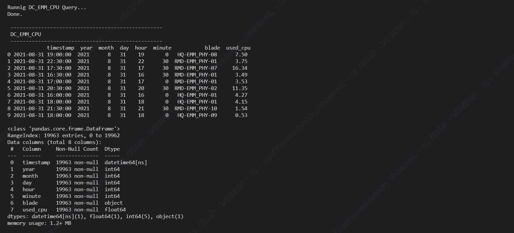
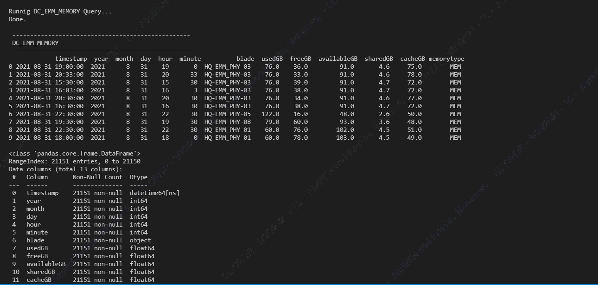
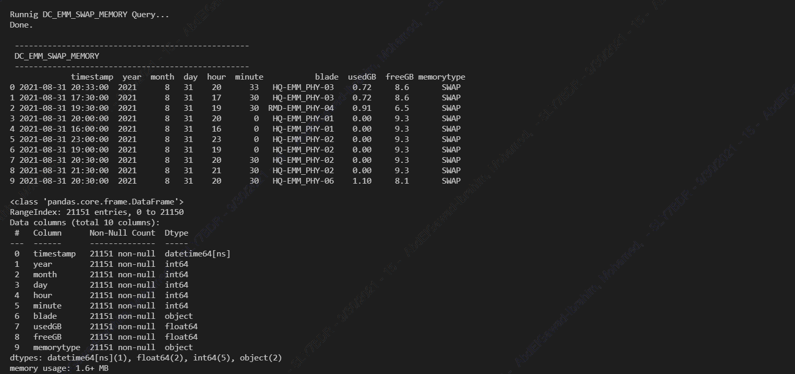
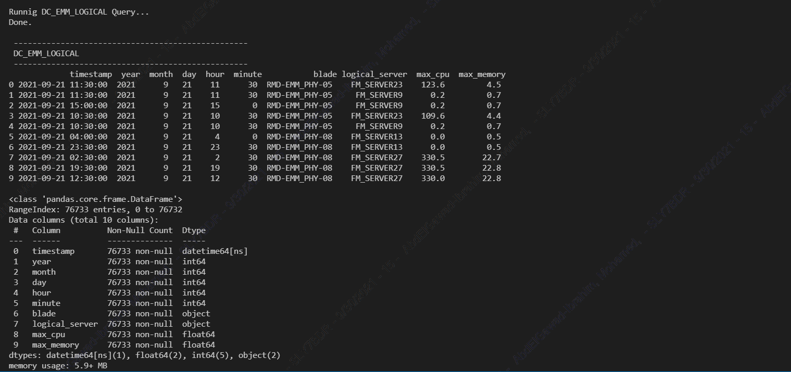
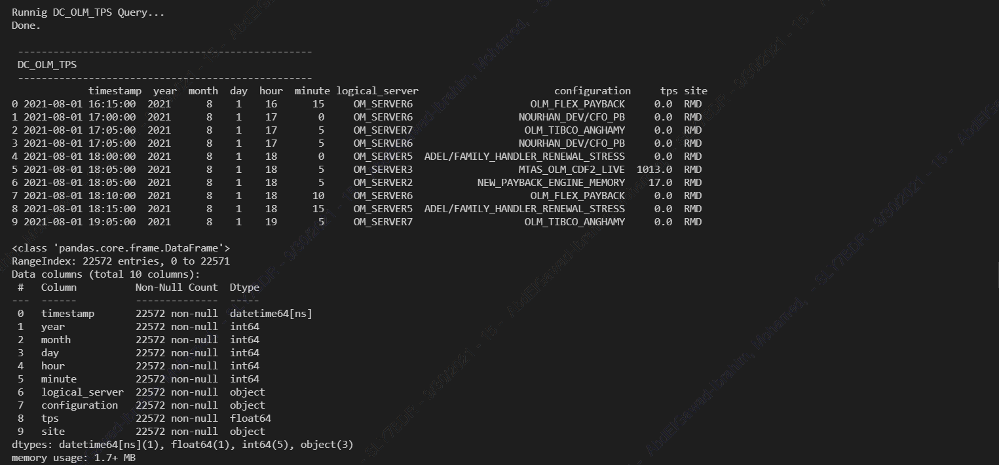
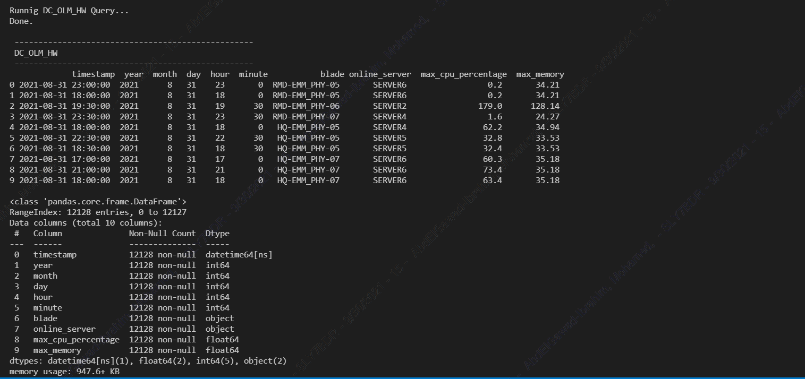
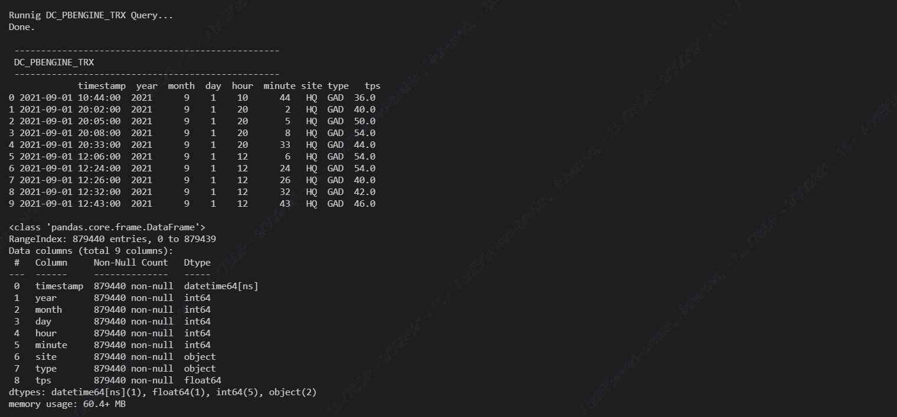
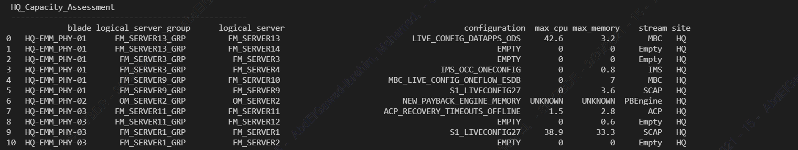
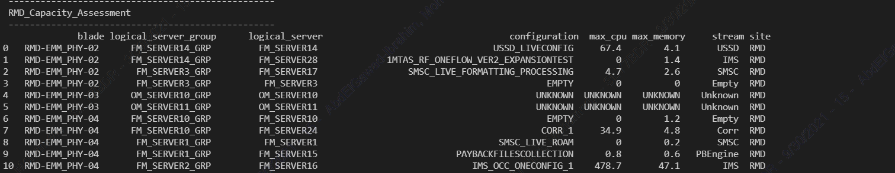

(<a href="#readme-top">back to top</a>)

### Tech Stack

This project was developed using the following technologies:

* **Python** (Libraries: `pandas`, `numpy`, `matplotlib`, `sqlalchemy`, `paramiko`, `time`, `datetime`, `sys`)
* **VS Code** (Text Editor)
* **Git** (Version Control)

(<a href="#readme-top">back to top</a>)

<!-- CONTACT -->
## Contact

Mohamed AbdelGawad Ibrahim - [@m-abdelgawad](https://www.linkedin.com/in/m-abdelgawad/) - <a href="tel:+201069052620">+201069052620</a>

(<a href="#readme-top">back to top</a>)

<!-- MARKDOWN LINKS & IMAGES -->
[linkedin-shield]: https://img.shields.io/badge/-LinkedIn-black.svg?style=for-the-badge&logo=linkedin&colorB=555
[linkedin-url]: https://www.linkedin.com/in/m-abdelgawad/
